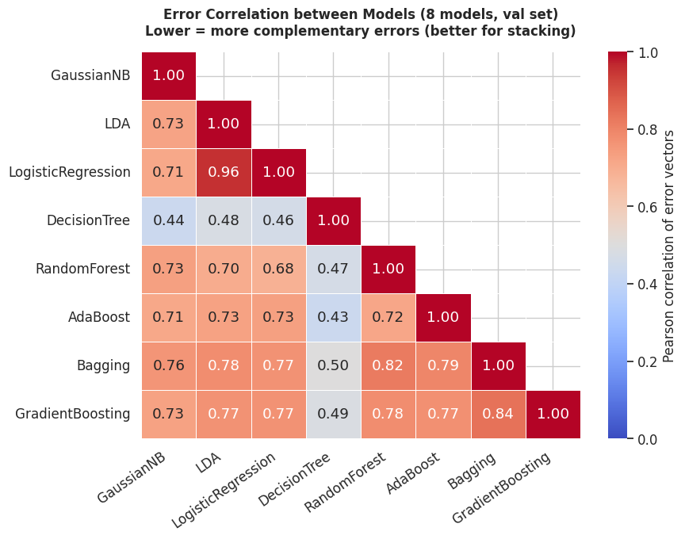
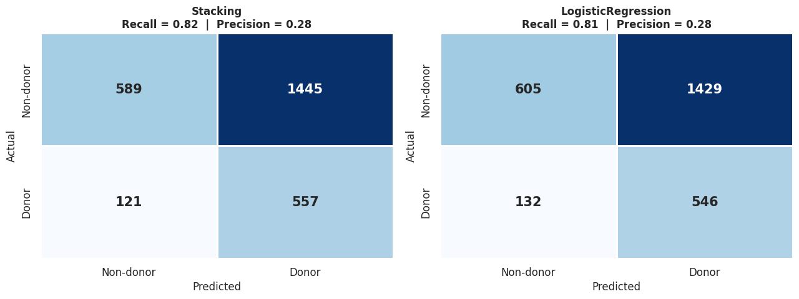

# Reach for Change: Predicting Donor Response for Social Good


> **Academic Context:** Data Mining II, Master's in Data Science & Advanced Analytics (BI) — Nova IMS (2025/2026)

---

## 🎯 1. Business Problem & Metric Selection

The **Civic Support Alliance (CSA)** seeks to modernize its outreach strategy by transitioning from traditional mass-solicitation to a data-driven targeted strategy. The goal is to identify individuals most likely to donate, maximizing campaign efficiency while minimizing **donor fatigue**.

**The Fallacy of Accuracy:**
With a **75/25 class imbalance** skewed toward non-donors, a baseline model predicting "No Donation" for everyone would achieve ~75% accuracy, rendering this metric completely uninformative. 
To rigorously evaluate model performance, we optimized for the **F1-Score**, perfectly balancing false positives (wasted outreach costs) and false negatives (missed donation opportunities).

---

## 🔍 2. The "White-Box" Approach (Academic Transparency)

A foundational architectural decision in this project was the deliberate exclusion of the `sklearn.pipeline.Pipeline` wrapper. In an academic context, it is critical to demonstrate mechanical control over data transformations.

We implemented a strictly manual, step-by-step **White-Box Preprocessing Approach**:
- Every step (Invalid handling ➔ Imputation ➔ Feature Engineering ➔ Log-transforms ➔ Scaling ➔ Encoding) was explicitly fitted on the training set and subsequently applied to the validation set.
- This exposed intermediate states (e.g., imputer medians, robust scaler IQRs) for real-time diagnostic inspection.
- It provided absolute, mathematically verifiable protection against **data leakage**.

---

## ⚙️ 3. Methodology & Model Screening

Following the **CRISP-DM** methodology, our pipeline was built with a rigid 80/20 stratified holdout validation split. 

```text
Raw Data (13,560 customers, 41 features)
    │
    ▼
Holdout Validation ──── Stratified 80/20 train/validation split (anti-leakage foundation)
    │
    ▼
Exploratory Data Analysis ──── Target signal, Missing patterns, Feature redundancies
    │
    ▼
White-Box Preprocessing ──── Explicit Fit/Transform (Imputation, Scaling, Encoding)
    │
    ▼
Feature Selection ──── Variance Threshold ➔ Correlation Redundancy ➔ Mutual Information
    │
    ▼
Model Screening ──── 8 Algorithms evaluated (Probabilistic, Linear, Tree, Ensemble)
    │
    ▼
Hyperparameter Tuning ──── Random & Grid Search (5-fold CV)
    │
    ▼
Final Model ──── Stacking Ensemble (Optimized threshold via TunedThresholdClassifierCV)
```

**Robust Selection (Mitigating Optimization Bias):**
To combat Cross-Validation Optimization Bias (Cawley & Talbot, 2010), we employed a robust selection mechanism. Instead of blindly accepting the GridSearchCV winner, we compared the default screening model, the Random Search winner, and the Grid Search winner on the untouched validation set, ensuring maximum generalizability.

---

## 🧠 4. Stacking Ensemble via Complementary Errors

The final deployed architecture is a **Stacking Classifier**. 
Crucially, the base estimators (Logistic Regression, Gradient Boosting, Decision Tree, Gaussian Naive Bayes) were not selected arbitrarily. They were chosen based on the principle of **Error Complementarity** (Kuncheva & Whitaker, 2003). 

By analyzing the Pearson correlation between the validation error vectors of the screened models, we selected a diverse cohort of algorithms where *one model's weakness is compensated by another's strength*. This theoretically grounded ensemble achieved significantly greater stability than any individual learner.

<div align="center">
  
  <br>
  <em>Figure: Pearson correlation of error vectors on the validation set. Lower correlation indicates higher complementarity.</em>
</div>

---

## 🚀 5. Key Results & The "Data-Limited" Conclusion

| Evaluation | Metric Result |
|:-------:|---------|
| **Validation F1-Score** | `0.416` (optimized cut-off at `0.415`, yielding +0.035 improvement over default) |
| **Kaggle Public Score** | `0.423` F1-score (Confirming absolute zero overfitting) |

<div align="center">
  
  <br>
  <em>Figure: Impact of threshold optimization on the Stacking Ensemble's Confusion Matrix, significantly boosting True Positives.</em>
</div>

**The "Data-Limited" Paradox:**
An extensive sensitivity analysis (sweeping alternative architectures, regularization schemes, and feature subsets) revealed that all variants converged near `F1 ≈ 0.41`. 

Our feature selection phase calculated a **maximum Mutual Information score of 0.014**, providing mathematical proof that this task is fundamentally **Data-Limited**. The achieved F1-score represents the absolute ceiling of predictability inherent in the data itself, rather than a constraint of the machine learning architecture.

---

## 💻 Tech Stack & Run Instructions

**Libraries:** `scikit-learn`, `pandas`, `numpy`, `matplotlib`, `seaborn`, `scipy`.

```bash
# Clone the repository
git clone https://github.com/diogovasconcelosmerca/Reach-for-Change-Donor-Prediction.git
cd Reach-for-Change-Donor-Prediction

# Install required dependencies
pip install -r requirements.txt

# Open the complete analysis pipeline
jupyter notebook Reach_for_Change_Predicting_Donor_Response.ipynb
```

---

## 👥 Authors

**Data Mining II** — MSc Information Management (BI)  
Nova IMS — Universidade Nova de Lisboa (2025/2026)

- [Diogo Merca](https://github.com/diogovasconcelosmerca)
- [Madalina Noje](https://github.com/madalinanoje)
- Alexandre Duarte
- Matilde Cordeiro
